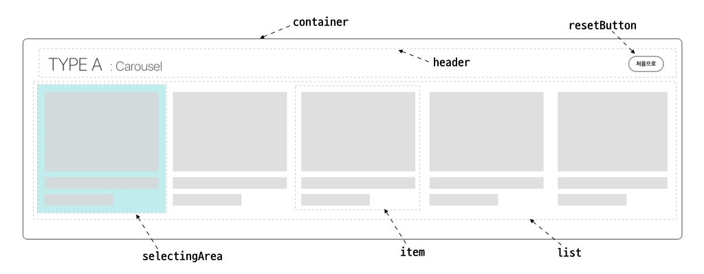

# React-List-UI

React-List-UI 는 빅스크린에서 키보드 입력을 통해 List UI를 선택적으로 동작할 수 있는 컴포넌트 입니다.

> **현재 개발 중인 프로젝트 입니다. 상위 내용은 언제든지 바뀔 수 있습니다.**

> **This project is currently under development. The above may be changed at any time.**

<hr />

## how to Use

1.  설치 방법

    ```bash
    $ npm install react-list-ui --save
    ```

2.  사용 방법

    ```javascript
    import React from 'react';
    import ListUI from 'react-list-ui';

    const App = () => {
      return (
        <div className='App'>
          <ListUI />
        </div>
      );
    };

    export default App;
    ```

    <hr />

## props

| Props             | Description                                                                                                                                       | Type                                      | Default                               | Example                                                                                                  |
| :---------------- | :------------------------------------------------------------------------------------------------------------------------------------------------ | :---------------------------------------- | :------------------------------------ | :------------------------------------------------------------------------------------------------------- |
| `type`            | **[필수]** List의 A,B타입을 선택합니다.                                                                                                           | [ 'A' , 'B' ]                             |                                       | type={ 'B' }                                                                                             |
|                   |                                                                                                                                                   |                                           |                                       |
| **공통**          | _type에 관계 없이 사용 가능한 props입니다_                                                                                                        |                                           |                                       |                                                                                                          |
| `itemList`        | List 내부에 들어갈 item들을 입력합니다.<br> 각 Object의 key:value는 자동으로 itemComponent의 props로 전달 됩니다.                                 | arrayOf(Object))                          | []                                    | `itemList={[{ title: 'first', content : 'first item' }, { title : 'second', content : 'second item' }]}` |
| `itemComponent`   | List 내부 item의 React Element를 전달합니다.                                                                                                      | React.Element                             | `<DefaultItemComponent />`            | `itemComponent={<YourCustomComponent />`}                                                                |
| `clickDisable`    | 마우스 클릭을 통한 선택 영역 이동 허용 여부를 결정합니다.                                                                                         | bool                                      | false                                 | `clickDisable={ true }`                                                                                  |
| `smoothScroll`    | 부드러운 스크롤 이동 여부를 결정합니다.                                                                                                           | bool                                      | true                                  | `smoothScroll={ false }`                                                                                 |
| `overScroll`      | 범위를 벗어나는 스크롤일 경우, 처음으로 돌아갈지 여부를 결정합니다. <br> False로 설정할 경우, 스크룰의 끝부분임을 알려주는 EndPoint가 표시됩니다. | bool                                      | false                                 | `overScroll={ true }`                                                                                    |
| `showResetButton` | Reset Button 표시 여부를 결정합니다.                                                                                                              | bool                                      | false                                 | `showResetButton={ true }`                                                                               |
|                   |                                                                                                                                                   |                                           |                                       |
| **Type A**        | _props.type === 'A' 의 경우 사용 가능한 props들입니다._                                                                                           |                                           |
| `itemStyle`       | Carousel 내부의 item들의 사이즈를 지정합니다.<br> Height와 Width를 지정할 수 있습니다.                                                            | Object({ height: string, width: string }) | {{ height: '18rem', width: '18rem' }} | `itemStyle={{ height: '300px', width: '300px' }}`                                                        |
|                   |                                                                                                                                                   |                                           |                                       |
| **Type B**        | _props.type === 'B' 의 경우 사용 가능한 props들입니다._                                                                                           |
| `itemStyle`       | List 내부의 item들의 사이즈를 지정합니다.<br> Height를 지정할 수 있습니다.                                                                        | Object({ height: string })                | {{ height: '18rem' }}                 | `itemStyle={{ height: '300px' }}`                                                                        |
| `col`             | List column의 item 개수를 지정합니다.                                                                                                             | number                                    | 4                                     | `col={5}`                                                                                                |

### Css Customizing props

#### _CSS를 Customizing하기 위한 Props들 입니다._

| Props                    | Description                     | type   |
| :----------------------- | :------------------------------ | :----- |
| `containerCssObjcet`     | container Css를 변경합니다.     | Objcet |
| `listCssObjcet`          | list Css를 변경합니다.          | Objcet |
| `itemCssObjcet`          | item Css를 변경합니다.          | Objcet |
| `selectingAreaCssObjcet` | selectingArea Css를 변경합니다. | Objcet |
| `headerCssObjcet`        | header Css를 변경합니다.        | Objcet |
| `resetButtonCssObjcet`   | resetButton Css를 변경합니다.   | Objcet |
| `endPointCssObjcet`      | endPoint Css를 변경합니다.      | Objcet |

```javascript
// CSS customizing props example
<ListUI containerCssObject={{ backgroundColor: 'red' }} />
```

#### _Customizing한 ClassName을 추가할 수 있습니다._

| Props                    | Description                             | type   |
| :----------------------- | :-------------------------------------- | :----- |
| `containerClassName`     | container에 ClassName을 추가합니다.     | String |
| `listClassName`          | list에 ClassName을 추가합니다.          | String |
| `itemClassName`          | item에 ClassName을 추가합니다.          | String |
| `selectingAreaClassName` | selectingArea에 ClassName을 추가합니다. | String |
| `headerClassName`        | header에 ClassName을 추가합니다.        | String |
| `resetButtonClassName`   | resetButton에 ClassName을 추가합니다.   | String |
| `endPointClassName`      | endPoint에 ClassName을 추가합니다.      | String |

> _이 Component는 styled-component를 사용하고 있습니다. className을 이용하여 styled-component보다 우선해 적용하고 싶다면 아래와 같이 사용하세요._

```javascript
// Add class props example


// app.js
<ListUI containerClassName='customClassName' />


// app.css
.customClassName.customClassName {
  background-color: red;
}
```

### _이 Component의 구조는 아래 이미지를 참고하세요._



<hr />

## LET'S TEST

### _다양한 props를 직접 넣으면서 Test해보세요_

[](https://codesandbox.io/s/react-list-ui-example-xkqrv?fontsize=14)

<hr />

### 추후 추가
